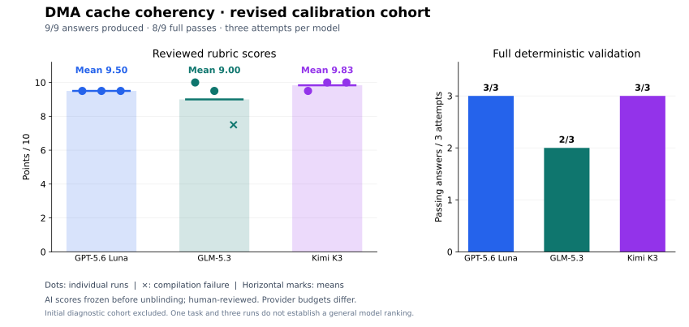

# Model-Family Calibration

Cross-model calibration checks whether a task is answerable, executable, and
consistently scored before its results are treated as benchmark evidence. It
does not replace fixture mutation testing or blinded rubric review.

## Protocol

For each task:

1. Run the trusted reference and require every controlled mutation to be
   rejected in the task's declared validation environment.
2. Declare at least three distinct model families and three independent
   scheduled attempts per model in a cohort plan before generation. Keep the
   task prompt and task metadata identical. Failed generations count as
   attempts; nine successful answers are not required.
3. Treat every raw result file as immutable once written. The harness preserves
   successful results but replaces unsuccessful records when the same jobs run
   again, so use a new attempt-specific output directory for every retry and
   retain the original failure evidence.
4. Record model IDs, provider adapters, material provider options, prompt and
   provider-configuration hashes, run count, and tool versions. Disclose
   provider differences rather than treating different adapters as identical.
5. For every generation that supplies an answer, record answer-contract
   extraction and, when extraction succeeds, deterministic validation in the
   same pinned profile/environment revision. Record extraction failure without
   repairing the answer. For a generation without an answer, extraction and
   validation are not applicable; retain the generation outcome instead.
6. Keep raw provider records and generated answers under ignored paths. Publish
   answer text only through the reviewed public-result export process.
7. Blind model identities before assigning rubric scores. An executable pass
   is validation evidence, not an automatic score of 10.

Create the private scoring artifacts under ignored `results/` paths:

```bash
npm run calibration:blind -- \
  --input results/<pilot> \
  --cohort results/<pilot>/cohort.json \
  --task <task-id> \
  --output results/<pilot>/blind-scoring
```

With `--cohort`, the command retains every declared attempt, extracts available
answers through the provider envelope parser, rejects normalized literal
model/provider identifiers in answer text, randomly assigns `sample-NN`
identifiers, and writes the answer
packet, a readable Markdown rendering, blank score sheet, and identity key
separately. Open `packet.md` for review instead of reading JSON-escaped answer
strings. It preserves line breaks and inner code fences inside inert Markdown
source blocks, and records the canonical `packet.json` and per-answer SHA-256
values. Score validation remains bound to `packet.json`. The reviewer packet
omits the rubric's `## Calibration` section so prior outcomes do not anchor the
new review while retaining the prompt, scoring criteria, and other rubric
sections. Manually review the packet for aliases or stylistic identity clues
that literal screening cannot detect. The packet records the sealed identity
key's SHA-256, committing the model/run mapping before review without
disclosing it. The key contains a random 256-bit nonce, preventing a reviewer
from brute-forcing the small permutation space from the public commitment.
Give a reviewer only
`packet.md`, `packet.json`, and `score-sheet.json`; tell them to open the
Markdown view and leave both packet files unchanged. Complete the sheet and
preserve its SHA-256 before anyone opens `identity-key.json`. After that
boundary, validate the key commitment, packet digest, answer digests, rubric
bounds, arithmetic, and model/run uniqueness while summarizing the scores:

```bash
npm run calibration:summarize -- \
  --directory results/<pilot>/blind-scoring
```

Packet inclusion attests only that provider generation succeeded and the
provider envelope contained an extractable answer. Before giving the packet to
a reviewer, separately verify the manifest-owned answer extraction and the
deterministic validation reports required by steps 1 and 5.

A task completes the executable part of this protocol when its trusted
reference passes, all controlled mutations are rejected, and every scheduled
attempt has current prompt provenance and a recorded generation outcome.
Available answers additionally require recorded extraction and applicable
validation outcomes. A missing result file is an incomplete attempt, not an
observed failure. Compilation, runtime, extraction, and generation failures
are useful calibration evidence and must not be silently rerun away.

The current scoring workflow is AI-assisted, human-reviewed: freeze the AI
criterion scores before unblinding, then obtain human review of the concrete
scores before publishing. Label that provenance explicitly and do not describe
approval of AI scores as independent human scoring. Independent blinded human
scoring remains a separate, stronger form of evidence, not a prerequisite for
this workflow. Generation failures have no rubric score; answer-quality means
are conditional on available answers and must accompany generation reliability.
An all-failure cohort supports a generation-reliability finding, not an
answer-quality ranking. The summarizer verifies scoring artifacts; it does not
attest fixture validation, model-family independence, or completion of every
publication gate.

## Declaring a Cohort and Generation Budgets

Copy `calibration-cohort.example.json` under the private pilot directory and
replace its placeholder model IDs, family labels, options, and configuration
fingerprints. Its contract is `schemas/calibration-cohort.schema.json`.
Freeze the plan and record its SHA-256 before generation. Each model entry
pins `modelName`, `modelId`, `provider`, `family`, `modelOptions`,
`providerConfigSha256` (null when unavailable), and unique positive `runs`.
The plan also pins the task ID and prompt SHA-256. Family labels are an
explicit researcher assertion and require review; distinct model aliases alone
do not prove different families.

Pass all original result records to `calibration:blind --cohort`, including
failures. Do not use an answer-only selection directory. The loader rejects
unplanned model/runs, mismatched prompts or options, and duplicate model/runs.
Retain retries in separate attempt-specific directories, disclose them
separately, and never substitute a successful retry into the original cohort.
A deliberately revised generation configuration requires a new prospectively
declared cohort, consistent settings within each model, and disclosure of
changes to reasoning, timeouts, provider context, or concurrency.

New raw records contain `generationBudget`: effective harness timeout,
configured reasoning control, allowlisted configured token limits, and unknown
provider token limits represented as null. An unreported limit is not an
unlimited budget. Historical records retain only explicitly recorded options;
current adapter defaults are not retroactively inferred. OpenCode exposes
`variant`, `timeoutMs`, and optional `maxOutputTokens` through this adapter.
The latter records the configured experimental output ceiling, not an attested
effective provider limit or a separate reasoning budget. The compatible HTTP adapter records supported numeric
limits supplied in `options.request`; those fields are provider-specific.
Changing reasoning settings may improve answer completion but is not guaranteed
to do so. Model-option changes invalidate result reuse; use a fresh output
directory to preserve the original cohort.

Cohort-aware artifacts use version 1.1. The sealed identity key commits the
plan, every scheduled slot, raw-result hashes, generation outcomes, budgets,
and the answer mapping. Reviewer packets expose only aggregate generation
counts plus anonymized available answers. Detailed failure records remain in
the sealed key so they cannot reveal model identities before scoring.
A cohort with zero answers still has an empty score sheet: a reviewer records
completion metadata after verifying that no answer is available, without
inventing rubric scores.

The summary reports `scheduled`, `recorded`, `answers`, `answerRate` (answers
per scheduled attempt), and outcome counts for each model and the cohort.
Outcomes are `answer`, `timeout`, `generation-limit`, `provider-error`,
`no-answer`, or `missing`. A length stop is classified only from provider event
metadata, not prose; otherwise a failed execution remains a provider error.
Rubric `runs` include scored answers only. Models with none remain in the
summary with empty runs and null mean, standard deviation, and range.
`cohortRecorded` means no planned result is missing, not that the task has
passed validation or human review. `plannedFamilyCount` describes the declared
plan, not a verified family classification.

Existing version 1.0 packets and summaries remain readable. Invoking
`calibration:blind` without `--cohort` retains the legacy successful-answer-only
workflow and cannot establish a generation denominator.

## Completed DMA Cache Pilot — `dma-cache-coherency`

The revised cohort `dma-cache-coherency-cross-family-20260919-02` adds
cache-range arithmetic, maintenance ordering, and DMA receive ownership to the
cross-family calibration surface. All nine scheduled attempts are recorded.
AI criterion scores were frozen before unblinding, and the conversation user
approved the scores, plot, and publication without changes on September 19,
2026 (America/Los_Angeles).

The initial nine-attempt cohort remains unscored diagnostic evidence with
identities sealed. Seven compiled answers rejected a second receive with
`BUSY`, while the fixture required `INVALID_ARGUMENT`; the initial prompt did
not explicitly name that rejection status. Another compiled answer assumed
`uintmax_t` was wider than `uintptr_t`, which holds on the nominal 32-bit target
but not the 64-bit host validator. One provider final-message answer was an
incomplete C fragment and failed compilation. None passed the full validator.
These records were preserved and are not pooled with the revised cohort.

Before the first cohort, both exact supplied headers, caller-state and
serialization assumptions, independent TX/RX behavior, and opaque address
recording were embedded in the prompt. Public checks were extended from four
to six groups and the mutation catalog from six to 13, adding exact cache-line
endpoints, maximum length, buffer-end and cache-rounding overflow, the last
representable range, status propagation, state preservation, and reinitialization.
The revised prompt then explicitly named the overlap rejection status and the
host's 64-bit `uintptr_t`/`uintmax_t` widths. Fixture, rubric, and provider budgets
were unchanged between cohorts.

The revised prompt SHA-256 is
`73d297090f49a44f63ec68bb2e3ad73171c2bb162861ed6047b4f52ec4e83b0d`;
the cohort SHA-256 is
`e0b039055fa87a50b5046392771585960b06a87cb3464a95787329158c144193`.
The private snapshot preserves harness base
`6fd6854dbb99dc9c43b0f33c7353bf1510e87b67` and the pre-generation changes.
The trusted reference passed all six public groups and all 13 compile-valid
mutations were rejected under `c11-host` revision 4,
`debian-13-x86-64-c11-host`, GCC 14.2.0, and Bubblewrap 0.11.0.

Three attempts per family ran in run-major order at concurrency one, with no
retries or candidate repairs. Settings were Luna medium/600 seconds, GLM
low/900 seconds/32,000 configured output tokens, and Kimi max/1,200 seconds/
64,000 configured output tokens. Provider budgets differ and effective provider
limits remain unknown. Recorded tools were Node 22.21.0, Codex CLI 0.155.1, and
OpenCode 1.18.31. Generation began on September 19 local time (September 20 UTC).

| Model | Run 1 / 10 | Run 2 / 10 | Run 3 / 10 | Mean / 10 | Full validation passes |
| --- | ---: | ---: | ---: | ---: | ---: |
| GPT-5.6 Luna | 9.5 | 9.5 | 9.5 | 9.500 | 3/3 |
| GLM-5.3 | 10.0 | 9.5 | 7.5 | 9.000 | 2/3 |
| Kimi K3 | 9.5 | 10.0 | 10.0 | 9.833 | 3/3 |



All nine revised answers extracted. Eight compiled and passed every public
test group. GLM run 3 failed compilation because its comment contained the
nested opener in `*base/*span`, rejected by `-Werror=comment`. It received zero
functional credit; static evidence supports other dimensions, and that same
defect was not deducted again elsewhere. Its score does not establish
executable correctness.

Clarity/validation deductions of 0.5 apply to Luna's three answers for test
guidance without concrete cases and expected observations; GLM run 2 for a
misaligned offset-31 test and incorrect range; GLM run 3 for a 32-bit overflow
example that is valid on the 64-bit host; and Kimi run 1 for an eight-byte
transfer at offset 0x1c incorrectly described as fitting within one cache line.
The public aggregate records each criterion and deduction rationale. Test code
was forbidden, and its absence was not penalized.

Scoring is **AI-assisted, human-reviewed**, not independent human scoring.
The AI reviewer had seen anonymized diagnostic answers before the revised
cohort. Revised answers were reviewed anonymously with hash-matched validation
evidence, scores were frozen, then model identities were revealed. The packet
SHA-256 is `2995e5f883e1d337ba14d3e6b3e97a282a40c97d0166b788aa2501736bd37104`;
the approved score-sheet SHA-256 is
`a68dffd69ee523a51776aa96937acd83e90e42c61c8a34e49fdd5f9bbf0ac29c`.

The approved [sanitized aggregate](calibration/dma-cache-coherency-2026-09-19.json)
and its derived plot are published. All nine answer projections passed
`export:public` with no redactions or review flags; raw records, projections,
identity keys, and review artifacts remain private. Three attempts per model
on one deterministic mock task, with different provider budgets and AI-assisted
grading, do not establish a broad model ranking.

## Completed RTOS Coordination Pilot — `rtos-event-flags-deadlock`

The revised cohort `rtos-event-flags-deadlock-cross-family-20260919-02`
adds event consumption, bounded mutex contention, global lock ordering, and
failure cleanup to the cross-family calibration surface. All nine revised
attempts are recorded and the AI criterion scores were frozen before
unblinding. The conversation user approved the scores and publication without
changes on September 19, 2026 (America/Los_Angeles).

The first cohort (`rtos-event-flags-deadlock-cross-family-20260919-01`)
recorded nine answers: eight extracted, two passed, six failed compilation, and
one failed extraction. Anonymized review exposed a prompt defect: RTOS function
names were listed without full signatures, and two answers supplied an extra
argument to `rtos_configuration_apply`. These records remain diagnostic evidence
under their original prompt; they are not replaced or pooled with the revised
cohort. No criterion scores were assigned or identities unblinded for cohort 01.

Before the revised cohort, both exact supplied headers were embedded in the
prompt, retaining the initial zero-initialization and valid-supervisor
clarifications. The revised frozen prompt SHA-256 is
`efc51538fbd562fef4b4538cc7928ade99def6d5adcd5363b5e18182ef192508`;
the cohort SHA-256 is
`c0680e0ebffc3d65da19c2d1caf680f2f95cfdfba73826ff1787ec0c62046540`.
The private snapshot preserves harness base
`b657b3e225c7081d35c5cd809838a44d4c808f4b` and the revised prompt.
The reviewer saw anonymized diagnostic answers before this revised cohort;
review of the revised answers retains its own identity blinding and score freeze.

The trusted reference passed all six public test groups and all seven
compile-valid mutations were rejected under `c11-host` revision 4,
`debian-13-x86-64-c11-host`, GCC 14.2.0, and Bubblewrap 0.11.0.
The cohort scheduled three attempts each for GPT-5.6 Luna (medium, 600 s),
GLM-5.3 (low, 900 s, 32,000 configured output tokens), and Kimi K3
(max, 1,200 s, 64,000 configured output tokens). Runs use concurrency one,
run-major ordering, no retries, and no candidate repairs. Provider budgets
differ and effective provider token limits remain unknown. Recorded versions
are Node 22.21.0, Codex CLI 0.155.1, and OpenCode 1.18.31.

Every attempt retains its original generation outcome. All nine revised answers
extracted; three compiled and passed all six public test groups, while six
failed compilation because they used `NULL` without including a defining
standard header. Candidates were not repaired or rerun.

| Model | Run 1 / 10 | Run 2 / 10 | Run 3 / 10 | Mean / 10 | Full validation passes |
| --- | ---: | ---: | ---: | ---: | ---: |
| GPT-5.6 Luna | 7.5 | 7.5 | 7.5 | 7.500 | 0/3 |
| GLM-5.3 | 7.0 | 7.5 | 7.5 | 7.333 | 0/3 |
| Kimi K3 | 9.5 | 9.5 | 9.5 | 9.500 | 3/3 |

All Luna and GLM answers failed compilation; all Kimi answers passed. Rubric
means include all three answers per model. Compilation failures received zero
functional credit, with static partial credit in other dimensions; the missing
header was not deducted again in portability. These scores do not establish
executable correctness. GLM run 1 additionally retained previously created
handles after mutex creation failed (static finding, fault recovery minus 0.5).
Its `initialized` flag stays false and operational API guards reject the state,
so the deduction reflects incomplete cleanup without a valid-state bypass.

All answers received 0.5/1 for clarity and validation. Luna omitted concrete
deterministic test scenarios. GLM and Kimi offered test discussion but overstated
lock cleanup, event-delivery, or deadlock/progress guarantees: attempting unlock
does not ensure it succeeds, event bits do not count repeated occurrences, and
this component's lock order cannot constrain an opposing peer. Timeout and
rollback bound that contention. Test code was forbidden and its absence was
not penalized. Each independent defect was deducted in its owning criterion.

Scoring is **AI-assisted, human-reviewed**, not independent human scoring.
Codex (GPT-6) reviewed anonymized answers and hash-matched validation evidence,
froze criterion scores, then unblinded model identities. The user approved the
model averages and individual scores with the linked deduction breakdown,
without changes. The packet SHA-256 is
`386bd26d6f92ca72f87b5c94a85ec12a6f13d05738bd028c95f902d2231008b1`;
the approved score-sheet SHA-256 is
`d84dc10c2dbc5282796a62878c8bf6491a54515cc4f995413b97cb7c3e9b9985`.

The approved, sanitized aggregate is
[`rtos-event-flags-deadlock-2026-09-19.json`](calibration/rtos-event-flags-deadlock-2026-09-19.json).
It includes per-criterion scores, deduction rationales, generation and validation
outcomes, provider controls, prior-cohort disposition, and review provenance.
All nine public-export projections passed with no redactions or review flags.
Only the aggregate is published; raw answers, projections, and review artifacts
remain private. Nine attempts on one deterministic mock task with different
provider budgets and AI-assisted scoring do not support a broad model ranking.

## Completed Security Pilot — `secure-maintenance-command`

The cohort `secure-maintenance-command-cross-family-20260917-01` completed
all nine scheduled attempts, with generation starting on September 17 in
America/Los_Angeles (September 18 UTC). The user approved the three-run model
averages and accompanying scores on September 19, then requested the
fault-recovery policy corrections identified in two rounds of PR review.

Before freezing the cohort, the prompt's abbreviated lifecycle and slot enum
names were expanded to the exact identifiers in the supplied header. Every
attempt uses prompt SHA-256
`7edde09044cf23fba280110bd91254ce4bc99f8a7a1d6288616e5c805a110f92`.
The cohort SHA-256 is
`04b831ae578152b75a21f2ae96aed9e3bb4c215a1d5cb52f3924342803da947a`.
The frozen harness base was `68eadeab3c440ff81366ed3c89c91b5222a50240`;
the private snapshot also preserves the pre-generation prompt correction.

| Model | Reasoning control | Timeout | Configured output ceiling |
| --- | --- | ---: | ---: |
| GPT-5.6 Luna (Codex) | medium effort | 600 s | Not configured |
| GLM-5.3 (OpenCode) | low variant | 900 s | 32,000 tokens |
| Kimi K3 (OpenCode) | max variant | 1,200 s | 64,000 tokens |

Runs used concurrency one, no retries, and no candidate repairs. Node 22.21.0,
Codex CLI 0.155.0, and OpenCode 1.18.31 were recorded. Provider adapters,
reasoning controls, timeouts, and configured output ceilings differ; effective
provider token limits remain unknown.

The frozen reference passed and all 40 compile-valid mutations were rejected
under `c11-host` revision 4, `debian-13-x86-64-c11-host` revision 1, GCC 14.2.0,
and Bubblewrap 0.11.0. All nine answers were extracted and validated in that
same environment: eight compiled, four passed all eight public test groups,
four failed at runtime, and one failed compilation. Existing evidence hashes
were verified during scoring; candidates were not repaired or rerun.

| Model | Run 1 / 10 | Run 2 / 10 | Run 3 / 10 | Mean / 10 | Full validation passes |
| --- | ---: | ---: | ---: | ---: | ---: |
| GPT-5.6 Luna | 7.5 | 9.5 | 9.0 | 8.667 | 2/3 |
| GLM-5.3 | 7.5 | 5.5 | 7.0 | 6.667 | 0/3 |
| Kimi K3 | 9.0 | 7.0 | 9.0 | 8.333 | 2/3 |

All models supplied three answers, so each mean includes every scheduled run,
including compilation and runtime failures. Luna run 1 omitted the mandatory
lock/revoke sequence in `expire`. Kimi run 2 and GLM run 1 retained expired
challenges. GLM run 2 used `sec0_handle_t` before its declaration and failed
compilation; static review additionally found malformed-length and expiry
handling defects. GLM run 3 omitted both success-state authorization flags and
retained expired challenges. Runtime tests stop at the first failure; additional
findings are static review, not further observed test outcomes.

Scoring is **AI-assisted, human-reviewed**. Codex (GPT-6) scored the anonymized
answers and hash-matched validation evidence, froze criterion scores before
opening the identity key, and presented model averages with individual scores,
pass counts, and a linked deduction breakdown. The conversation user approved
the original results without changes. PR review subsequently identified that
Luna run 1 and GLM run 2 retained fault-recovery credit despite mandatory
authorization-revocation violations. At the user's request, revision 1 applies
the `firmware-v1` safety-critical rule: fault recovery is zero for both runs.
Luna run 1 changes from 8.5 to 7.5 overall; GLM run 2 changes from 6.0 to 5.5.
A second full review identified the same safety-critical rule applying to
expired-challenge retention in GLM runs 1 and 3 and Kimi run 2. At the user's
request, revision 2 sets their fault-recovery credit from 1.5 to zero. Their
totals change from 9.0 to 7.5, 8.5 to 7.0, and 8.5 to 7.0 respectively.
Once expiry has been observed, retaining an active challenge allows it to
become eligible again when the half-range time comparison flips. That further
consequence is static analysis, not a newly executed candidate test.

Both corrections occurred **after unblinding**. The original frozen scores,
approval, and revision-1 scores remain preserved. The aggregate records all
three score-sheet hashes and both revisions. Across the two revisions, only
five fault-recovery scores changed; all other criterion scores and validation
outcomes are unchanged. This is not independent blinded human scoring.

Each distinct defect was deducted in its owning criterion. Compilation failure
received zero functional credit; other dimensions could receive static partial
credit. Missing NULL SEC0-handle guards lost 0.5 functional points in Luna run 3
and all Kimi runs under the invalid-API rule; that case is outside the public
test coverage. All answers received 0.5/1 for clarity and validation because
they lacked concrete validation cases and expected observations. Test code was
forbidden by the prompt, and its absence was not penalized. These scoring
interpretations were included in the approved review breakdown. Passing the
public fixture is therefore separate from receiving full rubric credit.

The reviewed sanitized aggregate is
[`secure-maintenance-command-2026-09-17.json`](calibration/secure-maintenance-command-2026-09-17.json).
It records criterion scores, run outcomes, statistics, provider controls,
review provenance, and artifact hashes. All nine answer projections passed
`export:public` with zero redactions or review flags. Only the aggregate is
published; raw provider records, answers, scoring sheets, and identity keys
remain private.

This pilot broadens calibration to attacker-controlled byte parsing, independent
replay domains, one-time challenges, cumulative lockout, and authorization
revocation. SEC0 supplies immutable verifier verdicts; these findings concern
the specified mock policy, not production cryptographic security or physical
attack resistance. Nine attempts on one task with different provider budgets
and AI-assisted scoring do not support a general model-family ranking.

`mpu-fault-containment` remains a ready candidate for further security
calibration. A new pilot requires its own prospective cohort and review.

## Completed Pilots

### `static-memory-pool` — 2026-08-25

The pilot used the unchanged task prompt with SHA-256
`fc2d1a32d946e0221c345df2fdfd472a1498a448d3aaaa3bb75906e2e48e6141`.
It ran from harness commit `c1416a3` under Node.js 22.21.0. Each family
produced three independent samples:

```bash
npm run benchmark -- \
  --models gpt-5.6-luna,glm53,kimi-k3 \
  --tasks static-memory-pool \
  --runs 1,2,3 \
  --concurrency 3 \
  --output results/static-memory-pool-cross-family-20260825
```

| Model family | Provider path | Material options | Generation | Validation |
| --- | --- | --- | --- | --- |
| GPT-5.6 Luna | Codex CLI 0.149.1 | `effort=medium`, 600 s timeout | 3/3 | 3/3 |
| GLM-5.3 | OpenCode 1.18.23 | 900 s timeout | 3/3 | 3/3 |
| Kimi K3 | OpenCode 1.18.23 | `variant=max`, 600 s timeout | 3/3 | 3/3 |

The Codex adapter ran ephemerally in a read-only sandbox with tools and web
search disabled. The OpenCode adapter used its isolated benchmark agent with
all permissions denied; its provider-configuration SHA-256 was
`ab82a7cc2d121908666852f90bd880bebade7af665b8ab826965f4e493e889c6`.
The Codex adapter did not expose a provider-configuration fingerprint, so its
invocation controls and CLI version are the available provenance.

All nine answers used the required single `c` fence, remained below the
1,400-word limit, compiled without diagnostics, and passed the public tests.
Their answer SHA-256 values were all distinct. Validation used `c11-host`
revision 4, profile SHA-256
`366cfeebdef4d1b1144c4a4cc60184a02fed782c22e51e14209f55bc860ddcf3`,
and `debian-13-x86-64-c11-host` revision 1 with GCC 14.2.0 under Bubblewrap
0.11.0. The environment SHA-256 was
`3fa38109eeeef8b8bb87936ea357907e2b561c5b305b8dea54ea35ecb70401e7`.
The trusted reference passed, and the validator rejected all six compile-valid
controlled mutations.

Raw outputs, extracted answers, and per-sample validation reports remain under
`results/static-memory-pool-cross-family-20260825/` and are intentionally
Git-ignored.

### Preliminary blinded rubric review — 2026-08-27

The blinding workflow was exercised on all nine complete answers. Codex
GPT-5.6 Sol scored the randomized packet before the identity key was opened.
The packet SHA-256 was
`de1427141b7af701b1d79c685ff456fdac26ed1768dccab8c73126c1aafc0035`;
the completed score-sheet SHA-256, frozen before unblinding, was
`b903f99129397cfee44f2c5fbbf65745185628d9d1b9876b21655d6c5e9abca7`.

| Model family | Run scores | Mean | Population SD | Range |
| --- | --- | ---: | ---: | ---: |
| GPT-5.6 Luna | 10, 10, 10 | 10.000 | 0.000 | 0.0 |
| GLM-5.3 | 10, 10, 10 | 10.000 | 0.000 | 0.0 |
| Kimi K3 | 10, 9.5, 10 | 9.833 | 0.236 | 0.5 |

Across all nine samples, the mean was 9.944 with a population standard
deviation of 0.157. The sole deduction was half of the portability point: one
answer formed the exclusive storage end as `base + span`, which can wrap when
a valid pool occupies the top of a `uintptr_t` address space. Offset-first
bounds checking avoids that edge case.

This was an AI rubric review used to verify the blinding and score-validation
workflow. It is disclosed separately and does not satisfy the independent
blinded human-review gate for publication-grade benchmark scores.
This dry run predated the identity-key commitment now required by the workflow,
so its packet and score-sheet hashes do not independently prove that the
model/run mapping remained unchanged before unblinding.

### Independent blinded human review — 2026-08-28

An independent human reviewer scored a new packet prepared after the
identity-key commitment and rubric-anchoring protections were in place. The
review bundle contained only `packet.json` and the blank `score-sheet.json`;
the packet omitted the rubric's prior calibration outcomes. The completed
score sheet was frozen before unblinding and identified the scorer by the
pseudonym `reviewer-01`.

The packet SHA-256 was
`7263938819eec9bfbeb7c04cbfedd95b650cc50fa03e5a94654d3bc2bbea9bef`, and the
completed score-sheet SHA-256 was
`d724fe5a02eef9333c8c411abb07ea803af93ef8bdc088e7554be19873609af2`.
The calibration summarizer validated the identity-key commitment, packet and
answer digests, rubric bounds and arithmetic, and model/run uniqueness before
producing the following result:

| Model family | Run scores | Mean | Population SD | Range |
| --- | --- | ---: | ---: | ---: |
| GPT-5.6 Luna | 10, 10, 10 | 10.000 | 0.000 | 0.0 |
| GLM-5.3 | 10, 10, 10 | 10.000 | 0.000 | 0.0 |
| Kimi K3 | 10, 10, 10 | 10.000 | 0.000 | 0.0 |

Across all nine samples, the mean was 10.000 with a population standard
deviation and range of zero. The reviewed, sanitized machine-readable summary
is committed as
[`static-memory-pool-2026-08-28.json`](calibration/static-memory-pool-2026-08-28.json).
Raw outputs, answer text, the packet, the completed score sheet, and the
identity key remain private under ignored `results/` paths.

This completes the independent-review gate for this pilot, but one reviewer
and one task do not establish a broad model-family ranking. The uniform scores
also motivate selecting a task intended to provide a broader discrimination
surface for the next pilot.

### `fixed-point-filter-optimization` — 2026-08-28

The pilot used the unchanged task prompt with SHA-256
`d56e3b38edbc561018e4bd5efbbf55a01857ae2fc84e0d9a7731826481db5cab`.
It ran from harness commit `b4fe078` under Node.js 22.21.0. Each family
produced three independent samples:

```bash
npm run benchmark -- \
  --models gpt-5.6-luna,glm53,kimi-k3 \
  --tasks fixed-point-filter-optimization \
  --runs 1,2,3 \
  --concurrency 3 \
  --output results/fixed-point-filter-optimization-cross-family-20260828
```

| Model family | Provider path | Material options | Generation | Validation |
| --- | --- | --- | ---: | ---: |
| GPT-5.6 Luna | Codex CLI 0.150.1 | `effort=medium`, 600 s timeout | 3/3 | 3/3 |
| GLM-5.3 | OpenCode 1.18.25 | 900 s timeout | 3/3 | 3/3 |
| Kimi K3 | OpenCode 1.18.25 | `variant=max`, 600 s timeout | 3/3 | 3/3 |

The Codex adapter ran ephemerally in a read-only sandbox with tools and web
search disabled. The OpenCode adapter used its isolated benchmark agent with
all permissions denied; its provider-configuration SHA-256 was
`ab82a7cc2d121908666852f90bd880bebade7af665b8ab826965f4e493e889c6`.
The Codex adapter did not expose a provider-configuration fingerprint, so its
invocation controls and CLI version are the available provenance.

All nine generated answers were distinct, extracted through the fixture-owned
single-file answer contract, and passed the deterministic validator. Validation
used `c11-host` revision 4, profile SHA-256
`366cfeebdef4d1b1144c4a4cc60184a02fed782c22e51e14209f55bc860ddcf3`,
and `debian-13-x86-64-c11-host` revision 1 with GCC 14.2.0 under Bubblewrap
0.11.0. The environment SHA-256 was
`3fa38109eeeef8b8bb87936ea357907e2b561c5b305b8dea54ea35ecb70401e7`.
The trusted reference passed, and the validator rejected all 33 compile-valid
controlled mutations.

An independent human reviewer scored the nine-answer Markdown packet after
the identity-key commitment was sealed. The completed score sheet was frozen
before unblinding and identified the scorer by the pseudonym `reviewer-me`.
The packet SHA-256 was
`790c322abcfa185f25614106db72e565657dad89f763cc03a1a63ab9de6c2c58`,
and the completed score-sheet SHA-256 was
`b30576dd226ab56a8f7b70d07585b53ee8431c54afa786a14ac924c831be5bc4`.
The calibration summarizer validated the identity-key commitment, packet and
answer digests, rubric bounds and arithmetic, and model/run uniqueness before
producing the following result:

| Model family | Run scores | Mean | Population SD | Range |
| --- | --- | ---: | ---: | ---: |
| GPT-5.6 Luna | 10, 10, 10 | 10.000 | 0.000 | 0.0 |
| GLM-5.3 | 10, 10, 10 | 10.000 | 0.000 | 0.0 |
| Kimi K3 | 10, 10, 10 | 10.000 | 0.000 | 0.0 |

Across all nine samples, the mean was 10.000 with a population standard
deviation and range of zero. The reviewed, sanitized machine-readable summary
is committed as
[`fixed-point-filter-optimization-2026-08-28.json`](calibration/fixed-point-filter-optimization-2026-08-28.json).
Raw outputs, extracted answers, validation reports, the review packet, the
completed score sheet, and the identity key remain under ignored `results/`
paths.

This completes the independent-review gate for the second pilot. The uniform
scores reinforce that two tasks and their human reviews remain insufficient
for a broad model-family ranking and motivate a more interaction-heavy next
pilot.

## Supervisor Pilot

Selected pilot: `supervised-process-service`.

This active embedded-Linux C fixture targets the still-partial supervised
service capability. Its deterministic POSIX mock makes process, pidfd,
`SOCK_SEQPACKET`, signal, timeout, restart, and bounded-shutdown interactions
observable without launching a real child. The trusted reference passes, and
all 53 compile-valid controlled mutations are rejected. Its coupled lifecycle
and failure-recovery requirements should provide a broader discrimination
surface than the two uniformly scored pilots while retaining repeatable host
validation.

An exploratory generation attempt on 2026-08-29 used the prior prompt SHA-256
`86316bf5fd663cf6562ed6b37cee9c12503ca0d79d0dd67589e454c7ae28a5c3`, which
included a 1,900-word whole-answer limit without a canonical automated count.
That limit had no defined treatment of source-code formatting and was removed
before blinded scoring. A preliminary 2026-09-04 cohort used prompt SHA-256
`9d82a074db34b9257d26b573fd87d76c717f4602195b8b7de812a3ebb5fa1508`, which
referenced `supervised_service.h` and `supervisor_os.h` without embedding their
exact declarations. Two tool-isolated samples declined to implement the task
rather than guess that unavailable API. The self-contained revision embeds the
complete public types, constants, and function signatures.
That self-contained prompt SHA-256 was
`4bd89610aa3a5ba9169ccbf8c8f0b2f3286b61ff12f60ea2b7ca3e6980de7c86`.
Only samples generated from that self-contained revision may be compared
within its historical cohort; both earlier cohorts remain private and excluded.

On 2026-09-06, the environment declaration was aligned with the actual pinned
validator: `c11-host` revision 4, `debian-13-x86-64-c11-host` revision 1,
Debian 13 x86-64 LP64, and GCC 14.2.0. No API, behavior, or scoring criteria
changed. The revised prompt SHA-256 is
`c74f0150c4baeae3ba927f2bf8e03e2ff38baaa543af06a1f606ef541f8bec44`.
This environment correction changes prompt provenance: future runs require a
fresh cohort; do not relabel or merge earlier records into it.

### Current-prompt calibration attempt — 2026-09-06

The attempt reused the three immutable current-prompt Luna samples generated
on 2026-09-05 UTC and generated three samples each from GLM-5.3 and Kimi K3.
All nine records have the pre-environment-correction self-contained prompt
hash `4bd89610aa3a5ba9169ccbf8c8f0b2f3286b61ff12f60ea2b7ca3e6980de7c86`. New generations
used harness commit `cecd00ff0b881d01453f7b2fb5e071aa88697446`, Node.js
22.21.0, OpenCode 1.18.29, and concurrency 3. GLM retained its 900-second
timeout; Kimi retained `variant=max` and its 600-second timeout. Luna's
recorded options were `effort=medium` and a 600-second timeout.

| Model family | Original generations with answers | Extraction | Deterministic validation |
| --- | ---: | ---: | --- |
| GPT-5.6 Luna | 3/3 | 3/3 | Two compilation failures; one runtime-test failure |
| GLM-5.3 | 0/3 | Not attempted | No answer to validate |
| Kimi K3 | 1/3 | 1/1 | One compilation failure |

GLM run 1 ended at the provider generation limit without answer text, run 2
failed with a provider database lock, and run 3 hit the 900-second harness
timeout. Kimi runs 1 and 3 ended at the provider generation limit without
answer text. These are generation outcomes, not rubric scores of zero, and
must remain in the original-attempt denominator even if later attempts
produce answers. Code-validation failures were retained without repair or
regeneration.

One separately recorded retry each for GLM run 2 and Kimi run 1 also ended
at the provider generation limit without answer text. Both retained the
original model options and used single-job runner invocations with staggered
launches; their generation periods overlapped other still-running jobs.
The original failures remain immutable. These two retries did not add any
answers to the scoring cohort.

The trusted reference passed in the pinned `c11-host` revision 4 environment
`debian-13-x86-64-c11-host` revision 1, using GCC 14.2.0 and Bubblewrap 0.11.0.
All four extracted answers used that same environment. Separately, the
reference baseline and all 48 controlled mutations passed their expected
checks. The prompt and rubric name Ubuntu 24.04; this attempt instead used
the profile's supported Debian 13 environment. That difference is disclosed
and must be retained with any interpretation of these results.

Raw records, isolated extracted answers, validation reports, mutation logs,
and the attempt audit remain private under
`results/supervised-process-service-cross-family-20260906-attempt-01/`.
Retry records are in the sibling directories ending
`20260906-retry-glm-r2-01` and `20260906-retry-kimi-r1-01`. A fresh private
`blind-scoring/` packet contains the four available answers, a blank score
sheet, and anonymized compiler/test evidence. A separate private
`ai-assisted-review-20260906/` draft reuses three verified prior AI ratings and
adds one provisional AI assessment. Its completed score sheet was hashed
before unblinding and passed the calibration summarizer. The user reviewed
and accepted the draft; it retains its AI-assisted provenance and does not
constitute independent blinded human review. The original human score sheet
remains blank.
At the time this attempt was prepared, the workflow required an answer-only
scoring cohort. The revised policy above counts failed generations as observed
attempts and requires no fabricated replacement answers. This historical
packet still uses the legacy workflow and does not commit the generation
cohort; its independent human review is pending. Do not label it a completed
calibration or infer a model-family ranking from the available answers.

### Environment-corrected cohort — 2026-09-06

The fresh prospective cohort completed all nine scheduled attempts under ignored
`results/supervised-process-service-cross-family-20260906-attempt-02/`.
Its frozen `cohort.json` and `cohort.sha256` declare three attempts each for
GPT-5.6 Luna, GLM-5.3, and Kimi K3 with prompt SHA-256
`c74f0150c4baeae3ba927f2bf8e03e2ff38baaa543af06a1f606ef541f8bec44`.
Generation used harness commit `550e757` and preserved the previous model
reasoning settings and 600/900/600-second timeouts. Concurrency was reduced
from three to one to avoid overlapping provider invocations after the earlier
database-lock failure. No historical samples or retries replace these attempts.

The trusted reference passed the pinned Debian 13 validation environment, and
all 48 controlled mutations were rejected before generation completed.
The follow-up script recorded all generation outcomes and extracted and validated
five answers: three from Luna and two from Kimi. GLM's three attempts ended
with provider `length` stops and no extractable answer; Kimi's other attempt
hit its 600-second harness timeout. All five original answers failed the
original validator (one compilation failure and four first-assertion runtime
failures). Raw records and validation reports remain unchanged.

The user requested an AI rubric review and then requested copying those
ratings into the original review sheet. That sheet retains `scorer.type` of
`ai-review`; a blank backup and the separate `ai-review-20260907/` artifacts
are preserved privately. This does not satisfy independent human review.
Means remain conditional on available answers, with generation failures kept
in the nine-attempt denominator and assigned no rubric score.

### Generation and fixture diagnostics — 2026-09-07

A separate prospective two-sample diagnostic plan completed under ignored
`results/supervised-process-service-diagnostics-20260907-01/`. It keeps the
corrected prompt unchanged and runs sequentially: one GLM attempt with the
catalog-supported `variant=low` and its existing 900-second timeout, followed
by one Kimi attempt with unchanged `variant=max` and a 1,200-second timeout.
It is not a three-family calibration cohort. Neither diagnostic replaces an
original attempt or contributes to the existing AI score means.

| Diagnostic | Duration | Provider completion | Extraction / original validation |
| --- | ---: | --- | --- |
| GLM-5.3, `variant=low`, 900 s timeout | 282.227 s | Normal stop; 18,894 reasoning and 4,990 output tokens | Extracted and compiled; nominal shutdown kill-count assertion failed |
| Kimi K3, `variant=max`, 1,200 s timeout | 577.141 s | An initial `unknown` step with zero reported usage, then `length`; 31,895 reasoning and 105 output tokens in the final step | Partial text with an unterminated C fence; extraction failed, validation not applicable |

GLM's sample supports lowering reasoning effort as a way to obtain an answer
within the current cap, not as proof of answer correctness or reliable
completion. Its source includes an extra zero-time pidfd probe, encountering
the mock-sequence limitation described below. Kimi stopped before even the
original 600-second timeout, so this attempt provides no evidence that a
longer timeout improves completion. Its nonempty partial text is classified
as an available answer by the cohort loader, but must be reported alongside
the explicit length stop and extraction failure, not as a complete solution.
The original fixture was snapshotted before the cleanup-order correction and
used for these diagnostic validation reports. Private `diagnostic-summary.json`
contains the plan digest, raw-result digests, budgets, stop events, and outcomes.

The installed OpenCode 1.18.29 catalog advertises a 131,072-token output limit
for both models. Inspection of that executable found a default 32,000-token
output cap and a transform taking the smaller of that cap and the model's
limit. The current diagnostic process has no
`OPENCODE_EXPERIMENTAL_OUTPUT_TOKEN_MAX` override. This matches the
[upstream provider transform](https://github.com/anomalyco/opencode/blob/dev/packages/opencode/src/provider/transform.ts)
and the documented
[experimental CLI control](https://dev.opencode.ai/docs/cli/).
The original GLM records report about 32,000 reasoning tokens and no text
event, consistent with exhausting this cap before a final answer. The
historical records do not attest the effective numeric request limit; this
finding must not be retroactively inserted into their raw metadata.

The original Kimi timeout has only a `step_start` event, so its upstream cause
is unknown. Its two successful attempts took about 232 and 558 seconds,
making a longer-timeout diagnostic useful without establishing that a longer
wait would have rescued the failed attempt.

The fixture audit found that the nominal test prescribed pipe close order
and handler restoration order beyond the prompt. Those assertions now check
exactly-once descriptor cleanup and restoration of both signals without
prescribing the relative cleanup order. The trusted reference and three
valid cleanup reorderings pass. All original 48 controlled mutations remain
rejected, along with two new missing/duplicate pipe-close mutations.

Supplemental validation of the five unchanged answers is stored separately
under the diagnostic directory's `fixture-audit/`. All five still fail after
this narrow correction: Luna run 1 reaches a restart-result failure, Luna
run 2 polls the pipe's write end, Luna run 3 retains its compiler failure,
Kimi run 1 encounters the scripted pidfd-probe mismatch, and Kimi run 3
reaches a graceful-cleanup EINTR failure. This is new validation evidence,
not a replacement for the original reports or a new rubric score.

Remaining contract issues need a separate revision before stronger comparative
claims: the mock consumes positional poll steps, so an extra zero-time pidfd
probe can consume the next shutdown event; poll descriptor order is also
script-dependent. The trusted reference tolerates `kill` returning `ESRCH`,
whereas the prompt's blanket termination-error wording does not state that
exception. These are audit findings, not reasons to silently change the
frozen prompt, repair candidates, or describe all runtime failures as model
quality defects. Any future prompt correction requires fresh provenance.

### Poll-contract revision — 2026-09-07

The fixture now routes poll events by descriptor role and keeps optional
zero-time pidfd observations from advancing the blocking-event script. The
reference and six valid cleanup/probe/descriptor-order variants pass. The
catalog now contains 53 controlled mutations, including explicit ESRCH
handling and incorrect wake-pipe descriptor checks.

The prompt explicitly permits optional zero-time probes and arbitrary poll
array order, and defines ESRCH from termination as benign while preserving
bounded waiting and exactly-once reaping. The revised prompt SHA-256 is
`6bdeb104ba14c437674e2da5da43c9578a2dc873c21a05458b2344059a3a7e01`.
Earlier cohorts and diagnostic records retain their original provenance.
Fresh diagnostic and calibration records are required for this revision.

### Completed revised-prompt cohort — 2026-09-08

The fresh cohort completed all nine scheduled attempts against the poll-contract
revision at harness commit `2ebb49c20d2eb4b637831576e54373a47b1b5f18`.
The cohort date uses America/Los_Angeles; generation finished on September 9 UTC.
All models received the identical revised prompt above. Runs were sequential
with concurrency one, no automatic retries, and no candidate repairs.

| Model | Reasoning control | Timeout | Configured output ceiling |
| --- | --- | ---: | ---: |
| GPT-5.6 Luna (Codex) | medium effort | 600 s | Not configured |
| GLM-5.3 (OpenCode Go) | low variant | 900 s | 32,000 tokens |
| Kimi K3 (OpenCode Go) | max variant | 1,200 s | 64,000 tokens |

Node 22.21.0, Codex CLI 0.153.4, and OpenCode 1.18.29 were used.
The provider adapters and controls differ, and effective provider token limits
are unknown. The machine-readable aggregate records the exact model IDs and
available provider fingerprints.

| Model | Run 1 / 10 | Run 2 / 10 | Run 3 / 10 | Mean / 10 | Full validation passes |
| --- | ---: | ---: | ---: | ---: | ---: |
| GPT-5.6 Luna | 2.5 | 4.0 | 3.5 | 3.333 | 0/3 answers |
| GLM-5.3 | — | — | — | — | No answers |
| Kimi K3 | 9.0 | 9.5 | 7.5 | 8.667 | 0/3 answers |

GLM runs 1 and 2 ended at a generation limit; run 3 timed out. These attempts
remain recorded and unscored, rather than receiving zero rubric points. Means
use available answers only. All three Luna answers failed compilation; all
three Kimi answers compiled but failed runtime assertions. Validation used
`c11-host` revision 4, Debian 13 x86-64, GCC 14.2.0, and Bubblewrap 0.11.0.
The deterministic pass count is zero, independently of rubric partial credit.

Scoring is **AI-assisted and human-reviewed**, not independent human scoring.
The AI reviewed the six anonymized answers and validation evidence, then froze
the criterion scores before opening the model/run identity key. The user
approved those scores without changes. Compiler failures received zero
functional credit; other dimensions were reviewed statically without repairing
the code. Defects were assigned to their owning dimensions to avoid duplicate
deductions. High rubric scores do not establish executable correctness.

The approved, sanitized aggregate is
[`supervised-process-service-2026-09-08.json`](calibration/supervised-process-service-2026-09-08.json).
It includes generation failures, per-run validation outcomes, score statistics,
review provenance, and prompt/packet/score hashes. The six answer projections
passed `export:public` with no redactions or review flags; the exporter cannot
project attempts lacking answer text, whose outcomes are retained in the
aggregate. Only the aggregate is published. Raw records, generated code,
review sheets, and identity keys remain private.

This completes the revised cohort and its approved review. The small sample,
missing GLM answers, differing provider budgets, and AI-assisted grading do not
support a broad model-family ranking. Earlier cohorts remain historical evidence
under their original prompts and fixtures.

## Completed Luna Reasoning Sweep — 2026-09-08

The frozen `supervised-process-service-luna-reasoning-20260908-01` cohort
scheduled three attempts each at low, medium, and high effort using GPT-5.6
Luna through the Codex adapter. All nine attempts are recorded. Generation
started on September 8 in America/Los_Angeles (September 9 UTC), using harness
commit `df749bf335968bc24b67880a41671485cf54e876`, Node 22.21.0, and Codex CLI
0.153.4. The prompt hash is
`6bdeb104ba14c437674e2da5da43c9578a2dc873c21a05458b2344059a3a7e01`.
Each level retained a 600-second timeout, concurrency one, no configured output
ceiling, and no retries or candidate repairs. Effective provider token limits
are unknown. These are three configurations of one family, not three families.

The existing frozen records were audited to completion on September 17.
The task, model, plan, rubric, fixture snapshot, and validation-profile catalog
hashes matched the preserved provenance. The trusted reference, six valid
variants, and all 53 controlled mutations were rechecked successfully. All five
answers were extracted and validated under `c11-host` revision 4, Debian 13
x86-64, GCC 14.2.0, and Bubblewrap 0.11.0. Original records and candidate
validation reports were preserved.

| Effort | Answers / attempts | Compiled and linked / attempts | Full passes / attempts | Mean attempt seconds | Mean answer seconds |
| --- | ---: | ---: | ---: | ---: | ---: |
| low | 2/3 | 2/3 | 0/3 | 46.2 | 67.9 |
| medium | 2/3 | 0/3 | 0/3 | 83.2 | 123.6 |
| high | 1/3 | 1/3 | 0/3 | 328.8 | 383.7 |

All three run-3 attempts encountered the account usage limit and remain
`provider-error` outcomes. High run 2 hit the harness timeout. These outcomes
are generation failures, not zero rubric scores or evidence of inferior code.
Mean attempt duration includes these failures; mean answer duration includes
only completed answers and is subject to that selection. The adapter did not
record structured per-attempt token usage. CLI stderr contains token totals for
completed answers, but no input/output/reasoning breakdown or totals for the
failed attempts; this aggregate makes no token-efficiency comparison.

Both medium answers omitted declarations for `O_NONBLOCK` and `O_CLOEXEC` and
failed compilation. The low answers and high answer compiled and linked but
failed runtime assertions: low run 1 failed nominal delivery/shutdown, low run
2 failed bounded-shutdown signaling, and high run 1 failed an invalid-pidfd poll
cleanup check. No effort level achieved a full deterministic pass. Five answers
on one task, ordered attempts, and quota-limited availability do not establish
a preferred reasoning level or a general model ranking.

The prospective plan excluded rubric scoring from this deterministic
comparison. No new rubric scores or human score approvals are claimed. The
current AI-assisted, human-reviewed rubric workflow remains unchanged.
The reviewed aggregate is
[`supervised-process-service-luna-reasoning-2026-09-08.json`](calibration/supervised-process-service-luna-reasoning-2026-09-08.json).
Only this allowlisted aggregate is committed; raw answers, diagnostics, paths,
and validation reports remain private. All five answer projections were checked
through `export:public` before publication.

### Reproducing the private sweep summary

```bash
npm run calibration:sweep:summary -- \
  --directory results/supervised-process-service-luna-reasoning-20260908-01 \
  --output results/supervised-process-service-luna-reasoning-20260908-01/new-summary.json
```

This command reads the frozen `cohort.json`, `cohort.sha256`, `tasks.json`,
`plan.json`, `provenance.json`, `fixture-hashes.json`, `fixture-snapshot/`,
`raw/`, and `validation-audit.json`. Each audit entry identifies `modelName`,
`run`, `outcome`, `resultSha256`, and `durationMs`, with nullable `extraction`
and `validation` evidence. Successful extraction supplies `success`, `sha256`,
and `outputPath`; validation supplies `success` and `reportPath`. Paths must
remain inside the private cohort directory. The command supports single-file
fenced answers, rechecks extraction against raw output, binds reports to answer
digests, requires the declared phase sequence and one validation environment,
and refuses missing attempts, duplicate evidence, or overwriting an output.
It does not execute candidates, repair evidence, score answers, or authorize
publication. Review the aggregate and model labels before copying it into docs.
